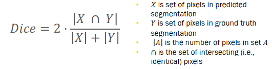

# TO-DOs/Tasks:
### CNN:
1. [✅] Use masks to normalize brain data
2. [ ] Train-test split
    - [ ] Randomly split participants: 520 training, ~104 validation & hypertuning, ~132 testing
        - Control for age and sex across splits ()
    - [ ] Evaluate CNN performance with Dice Score (dice_coef)?
        - 
    - [ ] Use Statistics and/or machine learning to identify relationship with participant age
        - Correlation, (non)-linear reggression, mutual formation, etc.